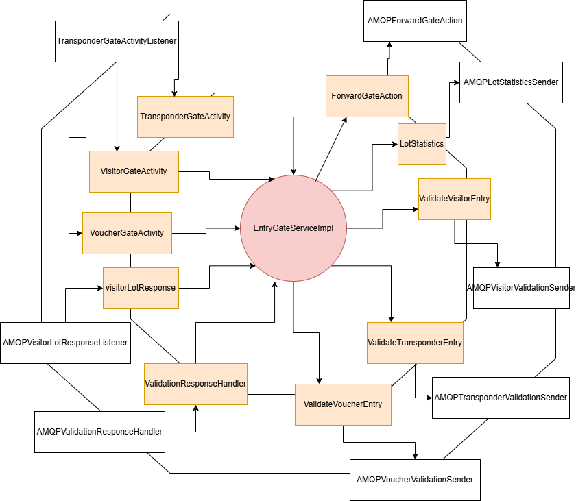

# Entry Gate

## Overview

The **Entry Gate** Service receives entry requests from the client side (scanners) to allow for cars to enter.
Cars can enter the parking lot if they have a valid transponder, a valid voucher, or if they are a visitor.
If they are a visitor then the lot needs to have capacity for the visitor to park on. 

## System Architecture

### Hexagonal Architecture

## Usage

Refer to README in [deployment](../../deployment/README.md) for instructions on how to run the service