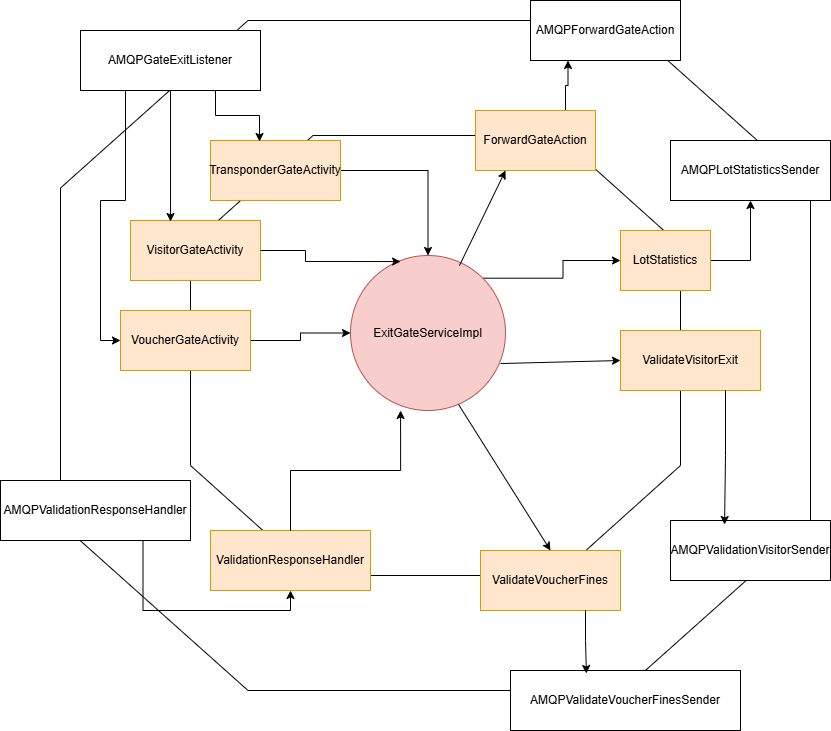

# Exit Gate

## Overview

The **Exit Gate** Service receives exit requests from the client side (scanners) to allow for cars to exit.
If the car has a valid transponder, the exit gate will open and allow the car to exit the parking lot.
If the car entered with a voucher, the service will talk back and forth with the **Fines** Service to determine
if the car has to pay any fees.
If the car entered was a visitor, the service will communicate with **Fines** Service and **Payment** Service as necessary
to complete the transaction

## System Architecture

### Hexagonal Architecture

## Usage

Refer to README in [deployment](../../deployment/README.md) for instructions on how to run the service