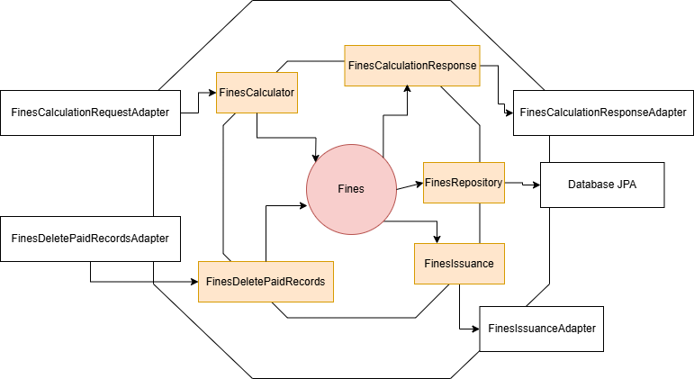

# Fines Service

## Overview

The **Fines Service** is responsible for managing all the fines within the university parking lots.

The **Payment Service** sends request to the  **Fines Service** to get the total amount of fines associated with a
customer.

Additionally, it allows **parking officers** to issue fines for violations within the parking lots.

## System Architecture

### Hexagonal Architecture

## Features

- **Fine Calculation**: Provides the **Payment Service** with the total amount of fines linked to a specific plate
  number.
- **Fine Issuance**: Enables officers to issue fines for parking violations or other offenses.

## Usage

Refer to README in [deployment](../../deployment/README.md) for instructions on how to run the service