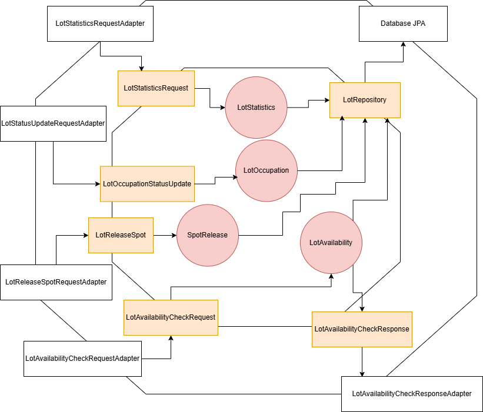

# Lot Service

## Overview

The **Lot Service** is responsible for managing all the parking lots within the university.

It handles requests from the **Permit Service**, **Voucher Service**, and **Entry Gate Service** to determine spot
availability for specific customer types and lot IDs. Additionally, it maintains records of reservation and
occupation statuses for all parking spots.

The service also processes requests from the **Permit Service**, **Voucher Service**, and **Entry Gate Service** to
release spots
associated with expired permits and vouchers, as well as when a visitor exits the gate. Furthermore, it provides REST
endpoints for the admin to monitor spot usage statistics and lot
performance.

## System Architecture

### Hexagonal Architecture

## Features

- **Spot Availability Check**: Determines the availability of unreserved spots for assignment to customers.
- **Spot Status Updates**:
    - Updates a spot's occupation status when a customer enters a lot (Entry Gate Service will send the request).
    - Changes the occupation status when the customer exits (Exit Gate Service will send the request).
- **Spot Release Management**:
    - Automatically releases spots linked to expired permits and vouchers.
    - Releases spots reserved by visitors upon their exit, mark the spots as unreserved
- **Administrative Statistics Access**: REST endpoints allow the system administrator to retrieve some statistics about
  lot utilization and spot statuses.

## REST interface

The service uses REST interfaces to provide statistics about the lots to admin.

All interfaces are exposed using Swagger:

- Web UI: [http://localhost:9082/swagger-ui.html](http://localhost:9082/swagger-ui.html)
- API Contract: [http://localhost:9082/v3/api-docs](http://localhost:9082/v3/api-docs)

## Usage

Refer to README in [deployment](../../deployment/README.md) for instructions on how to run the service