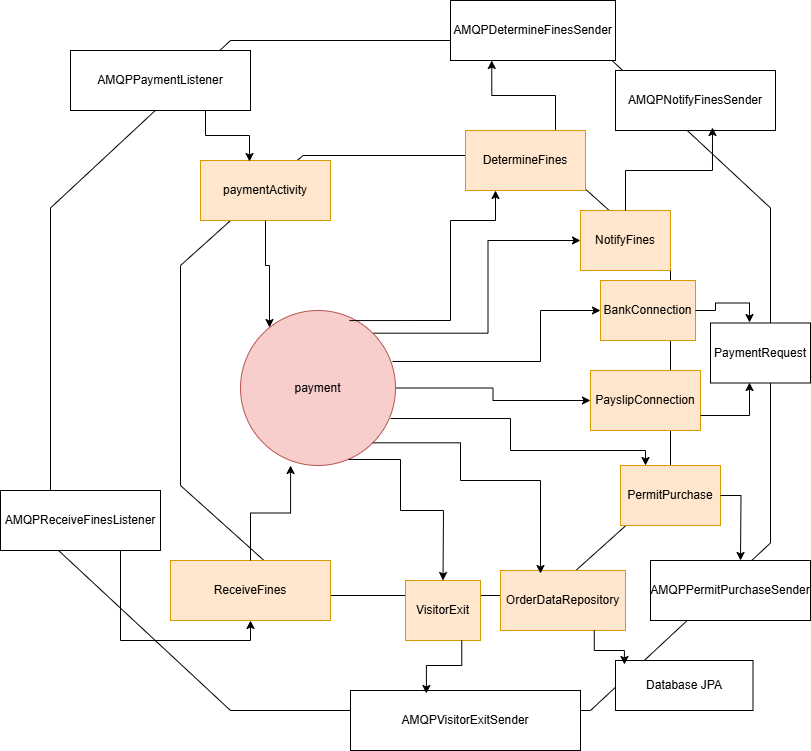

# Payment Service

## Overview

The **Payment** Service is responsible for calculating the required payments for visitor exit, a voucher exit (that
received a fine), and permit purchase alongside the required fines if the license plate had. It also commits the payments
by communicating to an external bank. Permits can also be purchased through the payslip system that this service
can talk to as well. The required payment responses are sent back to the appropriate location.

## System Architecture

### Hexagonal Architecture

## Usage

Refer to README in [deployment](../../deployment/README.md) for instructions on how to run the service