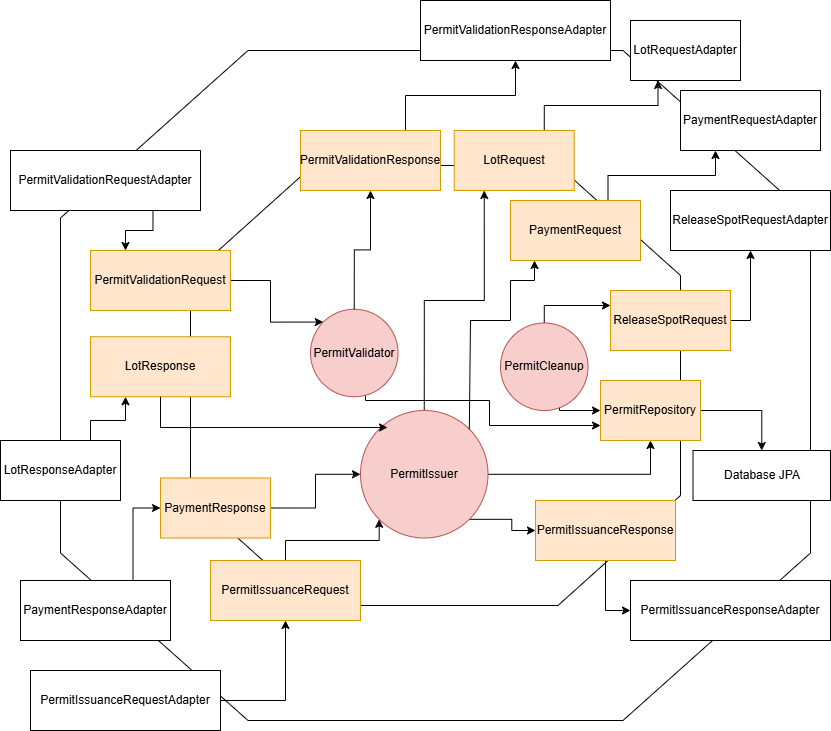

# Permit Service

## Overview

The **Permit Service** processes the permit issuance requests of **university members**. It ensures that only university
members with valid permits can access parking lots by performing a validation process.

University members can choose the months they want to get a permit for.

The service includes a cleanup process to remove expired permits from the database.

## System Architecture

### Hexagonal Architecture

## Features

- **Permit Issuance**: Allows university members to request a permit.
- **Validation**: Ensures that only university members with a valid permit can enter the parking lot.
- **Expiration Handling**: Periodically cleans up expired permits from the database to maintain system integrity.

## Usage

Refer to README in [deployment](../../deployment/README.md) for instructions on how to run the service