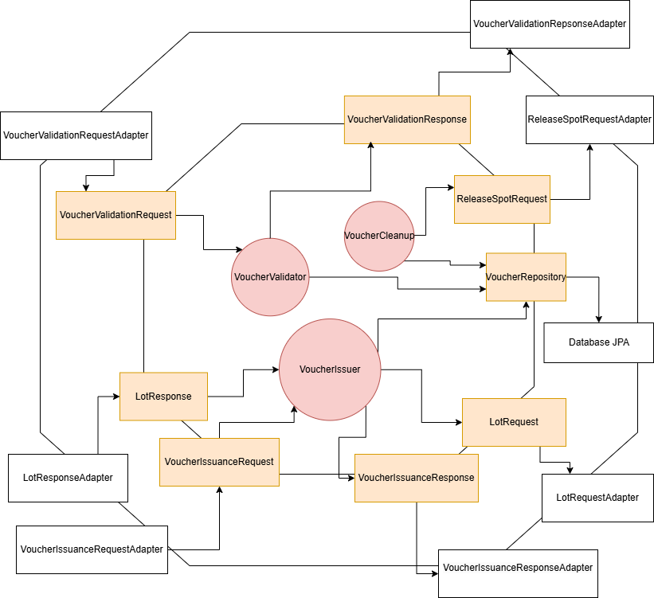

# Voucher Service

## Overview

The **Voucher Service** enables the **admin** to issue vouchers for parking. It ensures that only customers with valid permits can access parking lots by performing a validation process.

Managers can issue vouchers that are valid for **3 days**. The service includes a cleanup process to remove expired vouchers from the database.

## System Architecture

### Hexagonal Architecture

## Features

- **Voucher Issuance**: Allows managers to issue parking vouchers for customers.
- **Validation**: Ensures that only customers with valid vouchers can enter the parking lot.
- **Expiration Handling**: Periodically cleans up expired vouchers from the database to maintain system integrity.

## Usage

Refer to README in [deployment](../../deployment/README.md) for instructions on how to run the service